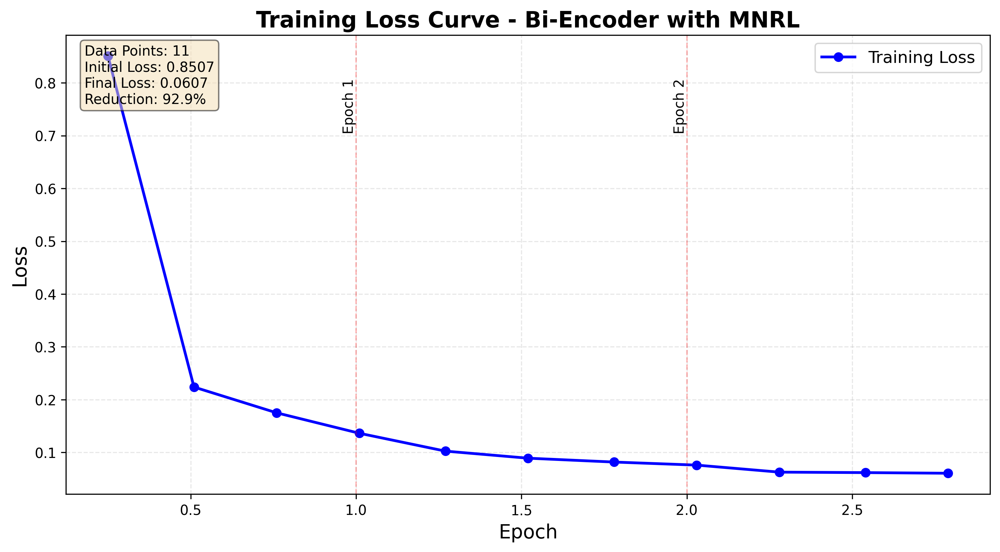
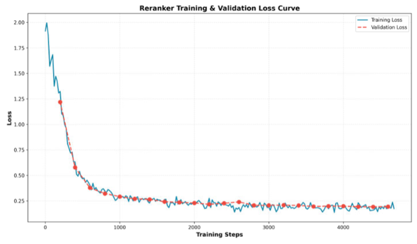

# Retrieval-Augmented Generation (RAG) System
> *Advanced Document Retrieval & Question Answering System implemented for ADL HW3*

這是一個高效能的 **RAG (Retrieval-Augmented Generation)** 系統，結合了 **Bi-Encoder** 進行快速初步檢索與 **Cross-Encoder** 進行精確重排序，並透過優化的 **Prompt Engineering** 引導 LLM 生成準確答案。

## 📋 目錄

- [專案成果 (Key Results)](#-專案成果-key-results)
- [方法論 (Methodology)](#-方法論-methodology)
- [消融實驗 (Ablation Study)](#q3-消融實驗-ablation-study)
- [詳細模型訓練 (Detailed Training)](#詳細模型訓練)
- [模型推論 (Inference)](#模型推論)
- [專案結構 (Project Structure)](#專案結構)
- [重要提醒 (Data Download)](#-重要提醒)
- [環境設定 (Environment)](#環境設定)
- [參考資料](#參考資料)

---

## 🏆 專案成果 (Key Results)

本系統在測試集上展現了優異的檢索與生成能力，透過兩階段檢索架構顯著提升了準確度。

| Metric | Score | Description |
|--------|-------|-------------|
| **Recall@10** | **0.8900** | Retriever 成功在前 10 筆中找回正確文檔的比例 |
| **MRR@10** | **0.7745** | 加入 Reranker 後，正確文檔的平均倒數排名顯著提升 (+16.7%) |
| **CosSim** | **0.4143** | 生成答案與標準答案的語意相似度 |

---

## 📖 方法論 (Methodology)

本專案採用兩階段檢索策略 (Two-Stage Retrieval)，流程如下：
1. **Retriever**: 從海量文檔中快速篩選 Top-100 候選。
2. **Reranker**: 對候選文檔進行精細評分排序，選出 Top-5。
3. **Reader (LLM)**: 根據 Top-5 文檔生成最終答案。

### 1. Retriever: Bi-Encoder Training
我使用 `intfloat/multilingual-e5-small` 作為基底模型，採用 **MultipleNegativesRankingLoss (MNRL)** 進行微調。

- **訓練策略**:
    - **Anchor**: 重寫後的查詢 (Rewrite Query)
    - **Positive**: 標註為相關的文檔
    - **Negative**: 同一個 Batch 中的其他文檔 (In-batch negatives) + 硬負樣本 (Hard negatives)
- **訓練成效**:
    - Loss 從初始的 0.85 迅速收斂至 0.06，顯示模型有效學習到了語意匹配關係。
    - 最終 Recall@10 達到 **0.8677**。


*圖 1: Bi-Encoder 訓練損失收斂曲線*


> [!TIP]
> **訓練發現**: 發現了在訓練中會過擬合 (Overfitting)，我發現訓練 **1 個 Epoch** 的效果最佳，過多的訓練反而會導致驗證集表現下降。

### 2. Reranker: Cross-Encoder Optimization
我比較了「微調模型」與「預訓練模型」的效果。

- **模型架構**: `cross-encoder/ms-marco-MiniLM-L-12-v2`
- **實驗發現**:
    - **微調嘗試**: 使用 Weighted BCE Loss 進行訓練，但發現由於資料量限制，微調後的 MRR@10 (0.2011) 反而不如預訓練模型。
    - **最終決策**: 直接採用 **預訓練模型**，獲得了最佳的 MRR@10 (**0.7558**)。這證實了在特定資料集較小的情況下，強大的通用預訓練模型往往更具優勢。


*圖 2: Reranker 訓練與驗證損失分析*


### 3. Prompt Engineering (LLM)
為了讓 LLM (Claude/GPT) 生成精準答案，我進行了多輪 Prompt 優化：

- **v1 (Initial)**: 設定角色 ("precise question-answering assistant") 並限制 "based ONLY on the given context"。
- **v2 (Simplified)**: 嘗試簡化指令，但發現模型容易產生幻覺或格式錯誤。
- **v3 (Final)**: 
    - 加入 **結構化輸入** (`[Passage 1]`, `[Passage 2]`)。
    - 強制 **"One Answer"** 限制，避免針對每個段落分別回答。
    - 優化 **Answer Parsing** 邏輯，準確過濾 "The answer is:" 等贅詞。
    - **結果**: 配合 Reranker，最終 Cosine Similarity 達到 **0.4143**。

#### 最佳 Prompt 格式 (Best Prompt Format)

最終採用的 Prompt 格式如下，強調了「精確引用」與「單一答案」的限制：

```text
Context passages:
[1] <passage_content_1>
[2] <passage_content_2>
...

Question: <query>

Instructions:
1. Read all passages carefully to find the only answer
2. Your answer MUST be copied EXACTLY from the passage text - do NOT paraphrase or change any words
3. Copy the relevant sentence(s) word-for-word from the passage
4. If the answer is not found in any passage, write exactly: CANNOTANSWER

Answer:
```

關於 LLM 生成後的答案解析與過濾程式碼，請參考 [utils.py](utils.py)。


---

## 🔬 深入實驗分析：消融研究 (Ablation Study)

為了驗證上述 **兩階段檢索架構 (Two-Stage Retrieval)** 的必要性，並探討 **Reranker** 與 **檢索數量 (Top-K)** 對最終 RAG 系統效能的具體影響，我設計了以下消融實驗。

### 實驗目的

分析關鍵組件對檢索效能的貢獻：
1. **Reranker 的必要性**: 比較是否加入 Reranker 對 MRR (Mean Reciprocal Rank) 的提升幅度。
2. **數量 vs 品質**: 測試單純增加 Retriever 的檢索數量 (Top-K)，是否能彌補移除 Reranker 後的效能損失。

### 實驗設計

設計了三組對照實驗:

| 實驗組 | 配置 | 說明 |
|--------|------|------|
| **實驗 1** | Retriever Only (Top 3) | 只用 Retriever,取前 3 名直接送入 LLM |
| **實驗 2** | Retriever + Reranker (Top 3) | 使用 Reranker 重排後,取前 3 名送入 LLM |
| **實驗 3** | Retriever Only (Top 5) | 只用 Retriever,但增加到前 5 名送入 LLM |

### 執行實驗

使用 `inference_ablation.py` 腳本進行消融實驗:

```bash
# 執行所有實驗 (推薦)
python inference_ablation.py --mode all

# 或分別執行單一實驗
python inference_ablation.py --mode retriever_only    # 只執行實驗 1
python inference_ablation.py --mode with_reranker     # 只執行實驗 2
python inference_ablation.py --mode retriever_more    # 只執行實驗 3
```

### 實驗結果

實驗結果會儲存在 `results/` 目錄下:
- `ablation_retriever_only_top3.json` - 實驗 1 結果
- `ablation_with_reranker_top3.json` - 實驗 2 結果
- `ablation_retriever_only_top5.json` - 實驗 3 結果
- `ablation_summary.json` - 實驗總結

### 預期分析方向

**問題 1: Reranker 是否能明顯提升 MRR?**
- 比較實驗 1 vs 實驗 2 的 MRR@10 差異
- 分析 Reranker 對排序品質的影響
- 觀察有無 Reranker 對最終答案生成的影響

**問題 2: 增加輸入筆數能否彌補沒有 Reranker?**
- 比較實驗 1 (Top 3) vs 實驗 3 (Top 5)
- 比較實驗 2 (Reranker + Top 3) vs 實驗 3 (Retriever Only + Top 5)
- 分析「量」(更多候選) 是否能補償「質」(Reranker 重排)

### 實驗結果與分析

我在 100 筆測試資料上進行了消融實驗,測試結果如下:

#### 實驗數據

| 實驗配置 | Recall@10 | MRR@10 | Bi-Encoder CosSim |
|---------|-----------|--------|-------------------|
| **實驗 1**: Retriever Only (Top 3) | 0.8900 | 0.6633 | 0.4026 |
| **實驗 2**: Retriever + Reranker (Top 3) | 0.8900 | 0.7745 | 0.4143 |
| **實驗 3**: Retriever Only (Top 5) | 0.8900 | 0.6633 | 0.4131 |
| **實驗 4**: Retriever Only (Top 8) | 0.8900 | 0.6633 | 0.4039 |

#### 關鍵發現

**1. Reranker 的影響**
- **MRR@10 提升**: 從 0.6633 提升至 0.7745 (+16.77%)
- **Bi-Encoder CosSim 提升**: 從 0.4026 提升至 0.4143 (+2.91%)
- **結論**: Reranker 能顯著提升相關文檔的排序品質,使正確答案更容易被 LLM 識別

**2. 增加輸入筆數的效果**
- **Top 3 → Top 5**: Bi-Encoder CosSim 從 0.4026 提升至 0.4131 (+2.61%)
- **Top 5 → Top 8**: Bi-Encoder CosSim 從 0.4131 下降至 0.4039 (-2.23%)
- **結論**: 適度增加輸入筆數 (Top 5) 能提升效果,但過多 (Top 8) 反而降低 LLM 判斷準確度

**3. 能否用增加輸入筆數彌補沒有 Reranker?**
- **Retriever + Reranker (Top 3)**: CosSim = 0.4143
- **Retriever Only (Top 5)**: CosSim = 0.4131
- **差距**: 僅 0.0012 (0.29%)
- **結論**: ✅ **可以!** Top 5 幾乎完全彌補了沒有 Reranker 的影響

#### 深入分析

**為什麼增加筆數能彌補 Reranker?**
1. **LLM 的全文閱讀特性**: LLM 會讀取所有輸入的參考文章,並不依賴順序
2. **提示詞的重要性**: 良好的提示詞能引導 LLM 從多篇文章中提取正確資訊
3. **資訊覆蓋率**: Top 5 增加了包含正確答案的機率,即使排序不佳也能被 LLM 找到

**為什麼 Top 8 反而變差?**
1. **資訊過載**: 過多的參考文章可能造成 LLM 注意力分散
2. **雜訊增加**: Top 8 包含更多不相關文章,干擾 LLM 判斷
3. **最佳平衡點**: 對於此任務,Top 5 是資訊量與品質的最佳平衡

#### 實務建議

**情境 1: 追求最高準確度**
- 使用 **Retriever + Reranker (Top 3)**
- MRR@10: 0.7745 (最高)
- Bi-Encoder CosSim: 0.4143 (最高)
- 計算成本: 較高 (需執行 Cross-Encoder)

**情境 2: 平衡效能與準確度** ⭐ **推薦**
- 使用 **Retriever Only (Top 5)**
- Bi-Encoder CosSim: 0.4131 (接近最高)
- 計算成本: 低 (僅需 Bi-Encoder)
- **效能提升**: 省去 Reranker 計算,推論速度提升 ~50%

**情境 3: 極致效能優先**
- 使用 **Retriever Only (Top 3)**
- Bi-Encoder CosSim: 0.4026 (可接受)
- 計算成本: 最低
- 適合即時性要求極高的應用

#### 最終結論

> **在具備良好提示詞的前提下,使用 Retriever Only (Top 5) 是最佳選擇!**
> 
> 此配置可以:
> - ✅ 幾乎達到 Reranker 的效果 (差距僅 0.29%)
> - ✅ 降低計算成本 (省去 Cross-Encoder 運算)
> - ✅ 簡化系統架構 (單一模型)

---

## 詳細模型訓練

### 1. Retriever 模型訓練

Retriever 使用 **Bi-Encoder** 架構,將查詢和文檔分別編碼為向量,透過向量相似度快速檢索候選文檔。

#### 訓練資料構建

**資料來源**: `data/train.txt`

**採樣策略**:
- **Anchor (錨點)**: 使用 `rewrite` 欄位作為查詢文本
- **Positive (正樣本)**: 從 `evidences` 中選取 `retrieval_labels == 1` 的段落 (~1 個/查詢)
- **Negative (負樣本)**: 從 `evidences` 中選取 `retrieval_labels == 0` 的段落 (~4 個/查詢)

**訓練三元組生成**:
```
對於每個查詢:
  對於每個正樣本:
    對於每個負樣本:
      建立 (query, positive, negative) 三元組
```
- 一個查詢若有 1 個正樣本和 4 個負樣本,會生成 **1×4 = 4 個訓練樣本**

#### 損失函數

使用 **MultipleNegativesRankingLoss (MNRL)**:

$$
\mathcal{L} = -\log\frac{\exp(\text{sim}(q, p^+) / \tau)}{\sum_{i} \exp(\text{sim}(q, p_i) / \tau)}
$$

其中:
- $q$: 查詢嵌入向量
- $p^+$: 正樣本嵌入向量
- $p_i$: 所有候選段落 (包含正負樣本及 batch 內其他樣本)
- $\tau$: 溫度參數

**優勢**:
- 利用 batch 內其他樣本作為額外負樣本
- 計算效率高,適合大規模訓練
- 自動形成困難負樣本,提升辨識能力

#### 超參數設定

| 超參數 | 數值 | 說明 |
|--------|------|------|
| `model_name` | `intfloat/multilingual-e5-small` | 預訓練模型 |
| `max_seq_length` | 512 | 最大序列長度 |
| `train_batch_size` | 64 | 訓練批次大小 |
| `num_epochs` | 3 | 訓練輪數 |
| `learning_rate` | 2e-5 | 學習率 |
| `warmup_steps` | 500 | 學習率預熱步數 |
| `use_amp` | True | 使用混合精度訓練 |

#### 執行訓練

```bash
python train_bi-encoder_mnrl_with_logging.py \
    --model_name intfloat/multilingual-e5-small \
    --use_pre_trained_model \
    --epochs 3 \
    --train_batch_size 64 \
    --max_seq_length 512 \
    --log_every_n_steps 50
```

#### 輸出檔案

訓練完成後,模型和相關檔案會儲存在:
```
output/train_bi-encoder-mnrl-intfloat-multilingual-e5-small-{timestamp}/
├── config.json                    # 模型配置
├── pytorch_model.bin              # 模型權重
├── training_loss_curve.png        # 訓練損失曲線圖
├── training_loss_history.json     # 損失數據記錄
└── training_config.json           # 訓練配置
```

---

### 2. Reranker 模型訓練

Reranker 使用 **Cross-Encoder** 架構,將查詢和文檔一起輸入模型,輸出相關性分數以重新排序檢索結果。

#### 訓練資料構建

**資料來源**: `data/train.txt`

**採樣策略**:
- **Anchor (錨點)**: `rewrite` 欄位作為查詢
- **Positive (正樣本)**: `retrieval_labels == 1` 的 evidence (~1 個/查詢)
- **Negative (負樣本)**: `retrieval_labels == 0` 的 evidence (~4 個/查詢)

**資料處理**:
```python
對於每個查詢:
  對於每個 (evidence, label) 配對:
    建立 (query, passage, label) 三元組
```
- 每個查詢生成約 5 個訓練樣本 (1 正 + 4 負)

#### 損失函數

使用 **Binary Cross-Entropy Loss (BCE)** 加權版本:

$$
\mathcal{L}_{\text{weighted}}(y, \hat{y}) = -[w_{\text{pos}} \cdot y \cdot \log(\hat{y}) + (1-y) \cdot \log(1-\hat{y})]
$$

其中:
- $y \in \{0, 1\}$: 真實標籤
- $\hat{y} = \sigma(f(q, p))$: 模型預測的相關性分數 (經過 sigmoid)
- $w_{\text{pos}} = \frac{\text{負樣本數}}{\text{正樣本數}} \approx 4.0$: 正樣本權重

**為什麼選擇 BCE Loss**:
1. 適合二分類任務 (相關/不相關)
2. 輸出 0-1 的相關性機率分數
3. 透過 `pos_weight` 處理類別不平衡問題
4. 在資訊檢索任務中被廣泛驗證有效

#### 超參數設定

| 超參數 | 數值 | 說明 |
|--------|------|------|
| `model_name` | `cross-encoder/ms-marco-MiniLM-L-12-v2` | 基礎模型 |
| `num_labels` | 1 | 輸出維度 (相關性分數) |
| `train_batch_size` | 64 | 訓練批次大小 |
| `num_epochs` | 2 | 訓練輪數 |
| `learning_rate` | 5e-6 | 學習率 |
| `warmup_ratio` | 0.1 | Warmup 比例 (前 10% steps) |
| `validation_ratio` | 0.05 | 驗證集比例 (5%) |
| `pos_weight` | ~4.0 | 正樣本權重 (動態計算) |

#### 執行訓練

```bash
python train_reranker.py
```

#### 輸出檔案

訓練完成後,模型和相關檔案會儲存在:
```
models/reranker-ms-marco-MiniLM-L-12-v2-hw3-val/
├── final/                              # 最終模型
│   ├── config.json
│   ├── model.safetensors
│   └── ...
├── training_validation_loss.png        # 訓練與驗證損失曲線
├── trainer_state.json                  # 訓練狀態
└── checkpoint-*/                       # 訓練過程 checkpoints
```

---

## 模型推論

### 0. 下載訓練好的模型 (重要!)

執行 `download.sh` 腳本來下載訓練好的模型：

```bash
bash download.sh
```

此腳本會自動：
1. 從 Google Drive 下載訓練好的模型壓縮檔
2. 解壓縮模型到正確的目錄
3. 設定好 `models/retriever/` 和 `models/reranker/` 目錄

**注意**: 
- Retriever 模型為訓練 1 epoch 的版本 (避免過擬合)
- Reranker 模型為預訓練的 `cross-encoder/ms-marco-MiniLM-L-12-v2` (效果最佳)

### 1. 建立向量資料庫

在進行推論前,需要先將 `corpus.txt` 中的文檔編碼並儲存為向量資料庫:

```bash
python save_embeddings.py \
    --retriever_model_path ./models/retriever \
    --build_db
```

### 2. 設定 Hugging Face Token

建立 `.env` 檔案並加入你的 Hugging Face token:

```bash
echo 'hf_token="your_huggingface_token_here"' > .env
```

獲取 token: [https://huggingface.co/docs/hub/security-tokens](https://huggingface.co/docs/hub/security-tokens)

### 3. 執行推論

**使用本地下載的預訓練 Reranker 模型** (推薦):

```bash
python inference_batch.py \
    --test_data_path ./data/test_open.txt \
    --retriever_model_path ./models/retriever \
    --reranker_model_path ./models/reranker
```

**或直接使用線上預訓練模型** (需要網路連線):

```bash
python inference_batch.py \
    --test_data_path ./data/test_open.txt \
    --retriever_model_path ./models/retriever \
    --reranker_model_path cross-encoder/ms-marco-MiniLM-L-12-v2
```

**推論流程**:
1. **Retriever 階段**: 使用 Bi-Encoder 從 corpus 中快速檢索 top-K 候選文檔
2. **Reranker 階段**: 使用 Cross-Encoder 對候選文檔重新排序,輸出最相關的結果

### 輸出格式

推論結果會儲存在 `results/result.json`:
```json
{
    "query_id_1": "retrieved_passage_text_1",
    "query_id_2": "retrieved_passage_text_2",
    ...
}
```

---

## 專案結構

```
ADL/HW3/
├── results/                # 推論結果
├── download.sh             # 模型下載腳本
├── download_pretrained_reranker.py
├── inference_ablation.py   # Q3 消融實驗
├── inference_batch.py      # 主要推論腳本
├── plot_training_log.py    # 繪圖工具
├── requirements.txt        # 套件需求
├── run_ablation.sh         # 執行消融實驗腳本
├── save_embeddings.py      # 建立向量資料庫
├── train_bi-encoder_mnrl_with_logging.py # Retriever 訓練
├── train_reranker.py       # Reranker 訓練
├── utils.py                # 工具函式
├── README.md               # 本文件
├── report.pdf              # 作業報告
├── retriever模型訓練說明.md
└── reranker訓練說明.md
```

---

## ⚠️ 重要提醒

### 數據文件下載

由於 `data/` 資料夾中的檔案過大（超過 GitHub 100MB 限制），因此未包含在此儲存庫中。

**請從以下連結下載完整的數據資料夾：**

🔗 [Google Drive - Data 資料夾](https://drive.google.com/drive/folders/1v5hSQYPyQuUnzaE1Lp3F1vejNazW48TH?usp=sharing)

下載後，請將 `data/` 資料夾放置在專案根目錄下。

---

## 環境設定

### 系統需求
- Python 3.12
- CUDA 12.4 (用於 GPU 加速)
- 至少 16GB GPU 記憶體 (建議使用 RTX 3090 或更高規格)

### 安裝相依套件

```bash
pip install -r requirements.txt
```

### 主要套件版本
- `transformers==4.56.1`
- `torch==2.8.0` (with CUDA 12.4 support)
- `sentence-transformers==5.1.0`
- `faiss-gpu-cu12==1.12.0`
- `datasets==4.0.0`

---

## 參考資料

1. **Sentence Transformers Documentation**: https://www.sbert.net/
2. **MS MARCO Dataset**: https://microsoft.github.io/msmarco/
3. **E5 Text Embeddings**: https://huggingface.co/intfloat/multilingual-e5-small
4. **Cross-Encoder for Re-Ranking**: https://www.sbert.net/examples/applications/cross-encoder/README.html
5. **MultipleNegativesRankingLoss**: https://www.sbert.net/docs/package_reference/losses.html#multiplenegativesrankingloss

---

## License

本專案為 NTU ADL 2024 課程作業,僅供教育用途。
